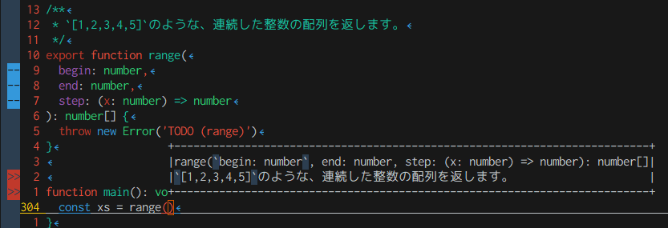

# 序

こんにちは :D
[aiya000](https://twitter.com/public_ai000ya)です。

普段は数学の本を書いています 😊 [^books]

[^books]: @[tweet](https://twitter.com/public_ai000ya/status/1147509549672198144?s=20)

ただいま弊社HIKKYでは、Nuxt3 + TypeScriptの最前線で開発をしています。
環境は最前線で、そしてフロントエンドチームメンバーも全員がかなりの技術力があると、日々実感しています。

ですのでもちろんコードもそこそこ整理されているのですが、僕的に一点だけ気になるところがあります。

皆、モノ [^thing] についての情報を**ドキュメントコメントで書かず、コメントで書くのです**……！！

[^thing]: 物。以下、関数や値・型などを指すことにします。

# なぜドキュメントコメントで書くのか？

LSPなどの静的解析ができるツールで、そのモノを書こうとしたときに**メソッド補完一覧など**で、書いたことが表示されるからです！



また、開発者はモノについての使い方・概要以外にも、歴史的経緯などの二次的情報が欲しいからです！

# ドキュメントコメントを書く

例示しましょう。
例えば以下のようなコメントです。

```typescript
/**
 * `[1,2,3,4,5]`のような、連続した整数の配列を返します。
 */

/**
 * ```typescript
 * const xs = range(0, 10)
 * xs.includes(10) // true
 * ```
 */
```

このような**説明は当然**として、ドキュメントコメントにした方がいいですよね！
これらは一次的な情報です。

しかし二次的情報は書かないタイプが、弊社の弊チームには多いようです。

# なぜドキュメントコメントを書かないでおいてしまうのか

最後に、これについて述べます。

結局のところ、おそらく「この程度の情報は、ソースを直接開いた人にだけ伝わればいいや……」と考えているからだと思います。

もしかしたら、ドキュメントコメントを知らないという場合もあるかもしれませんが、だいたいは↑だと僕は考えます。

もちろん、本当にドキュメントコメントにすべきではないコメントもあるでしょう。
しかしもう一度考えてください。
それのコメントは、周りが知るべきではない情報でしょうか？

そうでなければ、ドキュメントコメントにしましょう！

例: 筆者がドキュメントコメントにした方がいいと思う基準点

```typescript
/**
 * NOTE: もっといい書き方を募集。
 */

/**
 * TODO: 〇〇を書いたらそちらに統合。
 */

/**
 * Deprecated.
 * 今後は〇〇を使ってください。
 */
```

例: 筆者がコメントにした方がいいと思う基準点

```typescript
// おなかすいた
↑ここに書かずに食べよう。

// この案件はやばい。逃げろ。
↑逃げましょう。

// すみません、失礼します。
// この関数では〇〇をしたときに××になってしまうのですが、どうしてでしょうか。
// よろしくお願いします！
↑Discordで聞こう。
```

僕はそのモノたちについての多くの情報が欲しいです！
それにより僕は、そのモノの懸念点・気を付けるべきことを知ることができます。

# 終

コメントに控えめに書くなら、ドキュメントコメントに書こう！
